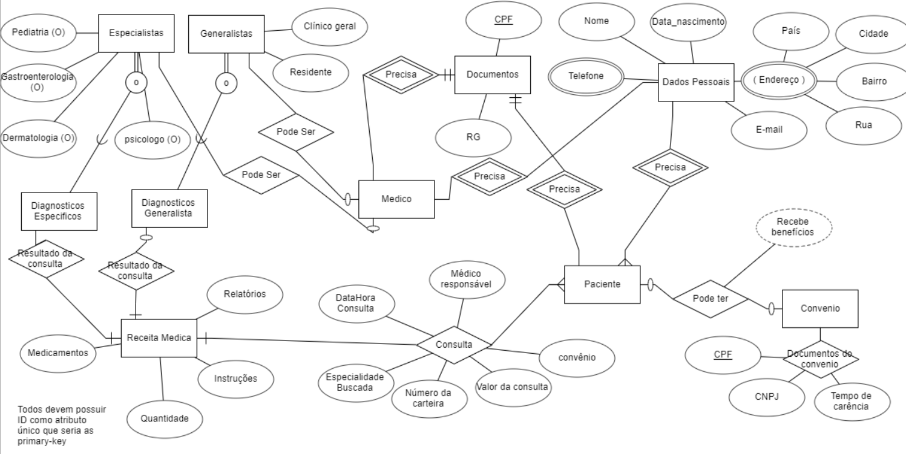
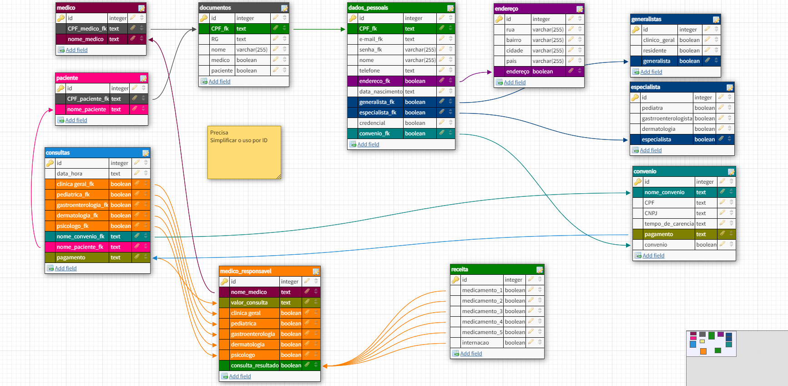
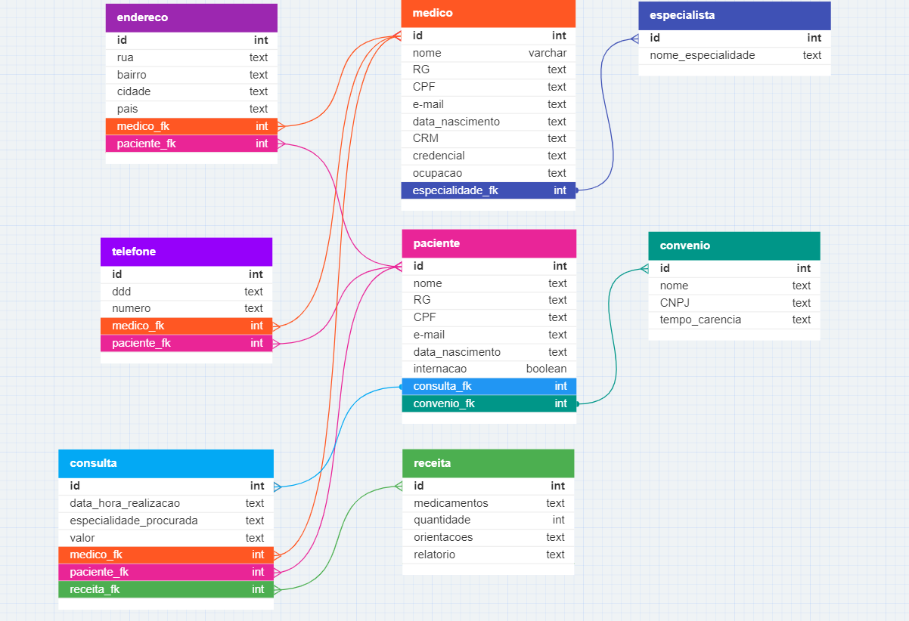
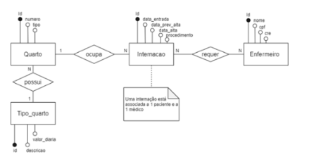
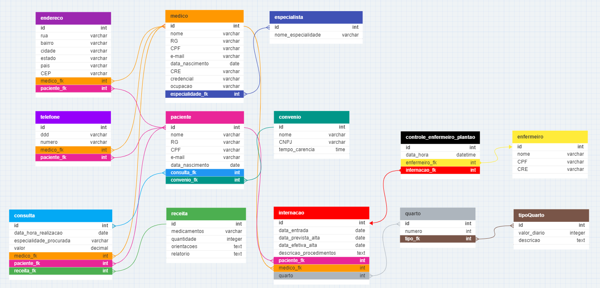

<h1 align='center'>Criando um Banco de dados para um Hospital</h1>

<h2 align='center'>▹ Entendendo o problema ◃</h2>
<h3 align='center'>Analise do Modelo de entidade-relacional para a criação do modelo conceitual</h3>

O hospital necessita de um sistema para sua área clínica que ajude a controlar consultas realizadas. Os médicos podem ser generalistas, especialistas ou residentes e têm seus dados pessoais cadastrados em planilhas digitais. Cada médico pode ter uma ou mais especialidades, que podem ser pediatria, clínica geral, gastroenterologia e dermatologia. Alguns registros antigos ainda estão em formulário de papel, mas será necessário incluir esses dados no novo sistema.

Os pacientes também precisam de cadastro, contendo dados pessoais (nome, data de nascimento, endereço, telefone e e-mail), documentos (CPF e RG) e convênio. Para cada convênio, são registrados nome, CNPJ e tempo de carência.

As consultas também têm sido registradas em planilhas, com data e hora de realização, médico responsável, paciente, valor da consulta ou nome do convênio, com o número da carteira. Também é necessário indicar na consulta qual a especialidade buscada pelo paciente.

Deseja-se ainda informatizar a receita do médico, de maneira que, no encerramento da consulta, ele possa registrar os medicamentos receitados, a quantidade e as instruções de uso. A partir disso, espera-se que o sistema imprima um relatório da receita ao paciente ou permita sua visualização via internet.

Também é necessário controlar quais profissionais de enfermaria estarão responsáveis por acompanhar o paciente durante sua internação. Para cada enfermeiro(a), é necessário nome, CPF e registro no conselho de enfermagem (CRE).

<h3 align='center'>Construção do Diagrama de entidade-relacional:</h3>

<i>
Pegamos todos os dados visiveis e criamos as conexões dele usando o DER, trazendo a noção de unidade e relacionamento ao nosso projeto(N:N).
</i>

 

 

<h2 align='center'>▹ Etapa 1 - Revisando e simplificando ◃</h2>
<h3 align='center'>Normalizando e criando o Modelo Logico</h3>

<i>
Usamos o DER para refinarmos todas as conexões, deixando ela mais precisa.
</i>

<h4 align='center'>Revisão</h4>
 

<h4 align='center'>Simplificação</h4>
 

 

<h2 align='center'>▹ Etapa 2 - A Expansão e definição de dados ◃</h2>
<h3 align='center'>Analise, revise e simplifique para conectar</h3>

No hospital, as internações têm sido registradas por meio de formulários eletrônicos que gravam os dados em arquivos. 

Para cada internação, são anotadas a data de entrada, a data prevista de alta e a data efetiva de alta, além da descrição textual dos procedimentos a serem realizados. 

As internações precisam ser vinculadas a quartos, com a numeração e o tipo. 

Cada tipo de quarto tem sua descrição e o seu valor diário (a princípio, o hospital trabalha com apartamentos, quartos duplos e enfermaria).

A internação, obviamente, é vinculada a um paciente – que pode se internar mais de uma vez no hospital – e a um único médico responsável.

<h4 align='center'>DiagramaER</h4>
 

<h4 align='center'>Modelo Logico</h4>
 

<h3 align='center'>Criação do Modelo Fisico</h3>

<i>
Apenas repassamos todos esses dados para o script sql, criando as tabelas e definições
</i>

 

<h2 align='center'>▹ Etapa 3 - Alimentando BD ◃</h2>
<h3 align='center'>Inserindo dados no modelo fisico</h3>

Pegamos o dicionario de dados e inserimos no MySQL Workbench 8.0

 

 

<h2 align='center'>▹ Etapa 4 - Melhorando BD ◃</h2>
<h3 align='center'>Alterando informações no BD</h3>

Modificando e corrigindo se necessario.

 

 

<h2 align='center'>▹ Etapa 5 - Consultando dados ◃</h2>
<h3 align='center'>Dando vida ao BD</h3>

Buscamos e trazemos informações necessarias e uteis do banco de dados

 

 

✦

